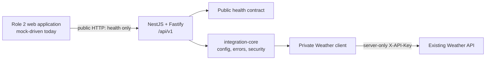

# IoT Soil Monitoring Project Status Report

Date: 2026-09-02

## Executive status

The Role 3 backend foundation, `integration-core`, is implemented and verified.
It is ready to support the design of `identity-access`; it is not yet a complete
business backend. The Role 2 frontend already contains the intended page groups,
but it is still a source-only, mock-driven snapshot and cannot yet consume real
authenticated station data.

| Area                 | Current state                                                      | Evidence                                |
| -------------------- | ------------------------------------------------------------------ | --------------------------------------- |
| Backend branch       | Complete locally on `codex/integration-core`; not pushed or merged | Commit `416fa0a` and a clean worktree   |
| Public backend API   | `GET /api/v1/health` only                                          | OpenAPI contract test                   |
| Backend tests        | 61 passing tests across 10 spec files                              | `pnpm test` on 2026-09-02               |
| Backend coverage     | 97.07% statements, 84.33% branches, 100% functions, 97.83% lines   | `pnpm test:coverage`                    |
| Dependency audit     | No known vulnerabilities                                           | `pnpm audit`                            |
| Frontend pages       | Admin, farm owner and client developer page groups exist           | `D:/IoT-web/src/pages`                  |
| Frontend integration | Mock/local only; no backend fetch layer found                      | `src/data/*` imports and mock `useAuth` |
| Frontend tooling     | Repository root has no package manifest or lockfile                | Read-only repository inspection         |

## Repository and branch state

### Backend

- Main checkout: `D:/IoT-api`
- Isolated worktree: `D:/IoT-api/.worktrees/integration-core`
- Working branch: `codex/integration-core`
- Base branch: `main` at `58000d0`
- Backend remote: none configured
- Latest completion commit: `416fa0a docs: record integration-core verification`

No backend commit has been pushed, merged or published.

### Frontend

- Checkout: `D:/IoT-web`
- Branch: `FE`, tracking `origin/FE`
- Latest observed commit: `3352d74 add`
- Remote: `https://github.com/Hn4785/IoT-web.git`
- The checkout contains `src/` but no root `package.json`, lockfile or build
  configuration, so it is not independently reproducible in its current form.

## Current architecture



The Weather client is intentionally private. No station or telemetry endpoint
is exposed until server-side identity, role and station-scope authorization
exist.

## Implemented backend capabilities

### Reproducible tooling

- Node.js is constrained to `>=24.19.0 <25`.
- The package manager is pinned to `pnpm@11.19.0`.
- TypeScript strict mode, ESLint, Prettier, Vitest and V8 coverage are configured.
- The pnpm lockfile is authoritative; optional Scarf telemetry is denied.

### Validated runtime configuration

- Environment, port, log level, Weather origin, API key and timeout are checked
  once at process startup.
- Blank credentials and invalid numeric bounds fail fast.
- Production Weather calls require an HTTPS origin.
- The normalized runtime object is immutable.

### HTTP contract and hardening

- Public liveness: `GET /api/v1/health`.
- Stable success envelope: `{ "success": true, "data": ... }`.
- Stable error envelope with machine code, safe message and request ID.
- Request IDs are generated or accepted only after length and CR/LF checks.
- Helmet security headers and a global request limiter are active.
- Unknown errors do not disclose stack, cause or exception message.

### Weather integration boundary

- Only literal paths for health, stations, latest and history are allowed.
- Query inputs are schema-validated and encoded with `URLSearchParams`.
- Caller input cannot choose an upstream host.
- `X-API-Key` is attached only to protected Weather calls, never upstream health.
- Calls have an explicit timeout and reject redirects.
- JSON and Weather response schemas are treated as untrusted external data.
- Timeout, transport, malformed payload, schema, 401/403/429/500 failures map to
  safe typed `AppError` values.

### OpenAPI and operator documentation

- Swagger UI is available at `/docs` in development/test.
- OpenAPI JSON is available at `/docs-json` in development/test.
- The document contains only `/api/v1/health` and no Weather credential contract.
- Both documentation routes return normalized 404 responses in production.
- Local commands, environment setup and the STRIDE threat model are documented.

## Verification evidence

The Task 10 gate ran the following commands successfully on 2026-09-02:

```powershell
pnpm format:check
pnpm lint
pnpm typecheck
pnpm build
pnpm test
pnpm test:coverage
pnpm audit
pnpm ignored-builds
git diff --check
```

Security scans found only documentation terms, explicit placeholders and test
markers. Git history contains no real Weather key. No unexpected dependency
build script is pending; Scarf remains explicitly denied.

The adversarial review confirmed named regression coverage for production HTTPS,
history limit 5000, fixed upstream host, the Weather health credential rule,
numeric timestamps, upstream timeout and safe HTTP 500 responses.

## Frontend alignment

The frontend currently declares these page groups:

| Role area        | Existing pages                                            | Backend dependency                                              |
| ---------------- | --------------------------------------------------------- | --------------------------------------------------------------- |
| Admin            | Dashboard, users, IoT configuration, devices, audit logs  | `identity-access`, `station-data`, `alert-config`, `operations` |
| Farm owner       | Dashboard, reports, notification settings, alert actions  | `identity-access`, `station-data`, `alert-config`               |
| Client developer | Dashboard, API keys, permissions, docs, explorer, metrics | `identity-access`, API-key slice, `station-data`, `operations`  |

Current frontend integration constraints:

- `useAuth` stores a mock user object in `localStorage`; it explicitly has no
  confirmed access-token or refresh-token contract.
- Pages import static data from `src/data/*`; no `fetch` or Axios service layer
  was found.
- `UserRole` still includes `technician` and `operator`, while the approved
  simplified model has three roles: Admin, Farmer and Client Developer.
- Default routes exist for technician/operator but no matching protected page
  routes exist.
- Developer pages display proposed station-data paths that the backend correctly
  does not expose yet.
- A suspicious duplicate filename, `UserManagement,nodule.css`, should be
  reviewed by Role 2 before frontend packaging.

Frontend route guards remain a presentation convenience. Backend authorization
must be the source of truth for every protected resource.

## Capabilities not yet implemented

| Missing capability                           | Why it is deferred                                     |
| -------------------------------------------- | ------------------------------------------------------ |
| PostgreSQL and Prisma models                 | First required by `identity-access`                    |
| Login, refresh, logout and recovery          | Token/session policy needs an approved spec            |
| RBAC and farm/plot/station scope             | Must exist before any station endpoint is public       |
| Public stations/latest/history               | Depends on identity and scope authorization            |
| API-key lifecycle for client developers      | Key hashing, scope and rotation need design            |
| Alerts and IoT configuration lifecycle       | Depends on authorized station data                     |
| Audit persistence, monitoring and deployment | Belongs to `operations` after business flows stabilize |

## Handoff conclusion

`integration-core` satisfies its approved scope and is ready for integration or
review. It should not be described as the complete backend. The next authorized
work is to brainstorm, approve and plan `identity-access`; the detailed sequence
is maintained in the backend completion roadmap.
