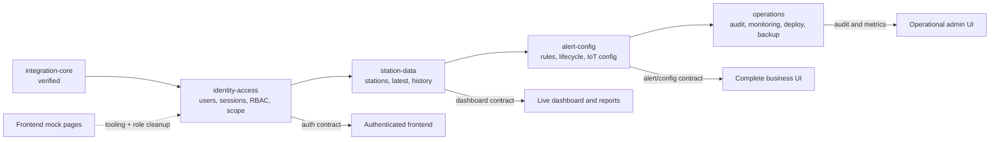

# Backend Completion Roadmap

Date: 2026-09-02

Status: Proposed for user review. No future module in this document is approved
for implementation until its own design spec is reviewed.

## Goal

Extend the verified `integration-core` foundation into a complete Role 3 backend
that can safely replace the frontend's mock authentication and static data,
support the agreed three-role model, and operate reliably in production.

## Dependency road

## Standing architecture rules

- Keep the public prefix `/api/v1` and the existing success/error envelopes.
- Maintain exactly three business roles: `ADMIN`, `FARMER`, and
  `CLIENT_DEVELOPER`; technician capabilities become Admin sub-permissions and
  operator capabilities become Farmer sub-permissions.
- UI route hiding never replaces backend authorization.
- Every farm, plot and station read/write is checked against server-side scope.
- Store only hashes of passwords, refresh tokens and client API keys.
- Database records never become public response DTOs directly.
- Every module starts with an approved design spec and a TDD implementation plan.
- Every vertical slice leaves build, test, lint, typecheck, audit and secret scan
  green.

## Decision gate before identity work

The `identity-access` brainstorm must resolve these choices:

1. Account provisioning: Admin-created/invited accounts or public registration.
2. Browser session model: access token placement, refresh mechanism, cookie
   policy, CSRF control and rotation/reuse detection.
3. Password policy, reset delivery and lockout/rate-limit behavior.
4. PostgreSQL deployment target, migration ownership and backup expectations.
5. Farm/plot/station scope inheritance and exceptional overrides.
6. Client Developer API-key scopes, expiration, rotation and rate-limit tiers.
7. Retention for users, sessions, audit records and deleted accounts.

Recommended starting defaults are Admin-provisioned accounts, short-lived access
tokens, rotating server-stored refresh-token hashes in secure HttpOnly cookies,
PostgreSQL with Prisma migrations, hierarchical scope inheritance, and hashed
client API keys with explicit station scopes. These remain proposals until user
approval.

## Work packages

Each package is a vertical slice. File paths are provisional until the owning
module spec is approved.

### Phase A: Identity and access

| ID   | Package                        | Acceptance criteria                                                                                                                | Verification                                      | Depends on         | Scope |
| ---- | ------------------------------ | ---------------------------------------------------------------------------------------------------------------------------------- | ------------------------------------------------- | ------------------ | ----- |
| IA-1 | Approve identity design        | Seven decision-gate questions resolved; threat model and public contracts approved                                                 | User reviews committed spec                       | `integration-core` | S     |
| IA-2 | PostgreSQL/Prisma boundary     | Reproducible migration creates user, role, scope and session foundations; startup fails safely when DB config is invalid           | Migration test, clean DB bootstrap, build         | IA-1               | M     |
| IA-3 | Admin provisions a user        | Only Admin can create/invite, suspend and assign one of three roles; safe DTO excludes credential fields                           | API integration tests and authorization negatives | IA-2               | M     |
| A1   | Persistence review gate        | Persistence model, migration evidence and Admin provisioning contract are accepted before login work starts                        | Review checklist and clean quality gates          | IA-3               | S     |
| IA-4 | Login and current session      | Valid credentials create the approved session; invalid/suspended users receive stable safe errors; `/me` returns the safe user DTO | Real HTTP auth tests                              | A1                 | M     |
| IA-5 | Refresh, logout and revocation | Rotation works; reuse is detected; logout/revocation invalidates the session; secret material is hashed                            | Concurrency and replay tests                      | IA-4               | M     |
| A2   | Session-security review gate   | Cookie/token handling, rotation, replay resistance and logout evidence are accepted before resource authorization                  | Security review and clean quality gates           | IA-5               | S     |
| IA-6 | Resource-scope guard           | Farm, plot and station inheritance is enforced server-side for Admin/Farmer; cross-scope reads return a non-leaking denial         | Table-driven authorization tests                  | A2                 | M     |
| IA-7 | Client API-key lifecycle       | Keys are shown once, stored hashed, scoped, expiring, rotatable and independently rate-limited                                     | Key lifecycle and leakage tests                   | IA-3, IA-6         | M     |

Checkpoint A: frontend can replace mock `useAuth`, remove extra roles and consume
`login`, `refresh/logout`, `/me` and Admin user-management contracts.

### Phase B: Authorized station data

| ID   | Package                     | Acceptance criteria                                                                                              | Verification                                    | Depends on | Scope |
| ---- | --------------------------- | ---------------------------------------------------------------------------------------------------------------- | ----------------------------------------------- | ---------- | ----- |
| SD-1 | Approve station-data design | Public DTOs, filters, pagination, caching policy and Weather-to-business mapping approved                        | User reviews committed spec                     | IA-6, IA-7 | S     |
| SD-2 | Authorized hierarchy/list   | Caller sees only assigned farms, plots and stations; Admin sees managed scope; pagination is bounded             | Real HTTP scope tests                           | SD-1       | M     |
| B1   | Scope review gate           | Hierarchy ownership and cross-scope denial evidence are accepted before measurement data is public               | Authorization review                            | SD-2       | S     |
| SD-3 | Latest measurements         | Authorized station query returns validated frontend DTOs and never exposes upstream envelopes or credentials     | Contract and hostile-input tests                | B1         | M     |
| SD-4 | Historical measurements     | UTC range, limit/order/interval/aggregate are bounded; response supports charts and reports                      | Boundary, pagination and upstream failure tests | SD-3       | M     |
| SD-5 | Client Developer access     | API-key caller receives only granted station fields and rate-limit metadata through the approved public contract | API-key scope and rate-limit tests              | SD-3, IA-7 | M     |

Checkpoint B: frontend can replace `src/data/farms`, `plots`, `stations` and
`soilData`; dashboards, history reports, developer explorer and docs use live API
contracts.

### Phase C: Alerts and in-app notifications

| ID   | Package                   | Acceptance criteria                                                                                     | Verification                        | Depends on | Scope |
| ---- | ------------------------- | ------------------------------------------------------------------------------------------------------- | ----------------------------------- | ---------- | ----- |
| AC-1 | Approve alert design      | Rule model, lifecycle, in-app notifications and device-config deferral approved                         | User reviews committed spec         | SD-4       | S     |
| AC-2 | Alert rules               | Authorized users create/update bounded threshold rules for their station scope                          | CRUD and cross-scope tests          | AC-1       | M     |
| AC-3 | Alert lifecycle           | Triggered alerts have deterministic open, acknowledge and resolve transitions with actor/time evidence  | State-machine and idempotency tests | AC-2       | M     |
| C1   | Lifecycle review gate     | Alert transitions, idempotency and actor evidence are accepted before external providers are connected  | Review checklist and state tests    | AC-3       | S     |
| AC-4 | In-app notification inbox | Scoped open/acknowledge/resolve notifications are durable, unread-aware and duplicate-safe              | Scope and concurrency tests         | C1         | M     |
| CDEV | Device-configuration gate | No payload or publish API exists until hardware schema, units and transport receive a separate approval | Contract review                     | B-device   | S     |

Checkpoint C-core: frontend alert action center and in-app inbox can replace
mock state; the device-configuration page reports the capability unavailable.

### Phase D: Operations and production readiness

| ID   | Package                        | Acceptance criteria                                                                            | Verification                             | Depends on         | Scope |
| ---- | ------------------------------ | ---------------------------------------------------------------------------------------------- | ---------------------------------------- | ------------------ | ----- |
| OP-1 | Persistent audit log           | Security and admin actions record actor, action, target, result and request ID without secrets | Tamper/leakage and query tests           | IA-3, AC-5         | M     |
| OP-2 | Observability/readiness        | Structured logs, DB/upstream readiness, metrics and alertable failure signals exist            | Failure-injection tests                  | SD-4               | M     |
| D1   | Operations review gate         | Audit leakage tests and failure-injection signals are accepted before delivery automation      | Operations/security review               | OP-1, OP-2         | S     |
| OP-3 | Container and CI quality gates | Reproducible image and CI run immutable install, build, tests, coverage, audit and secret scan | Clean CI rehearsal                       | D1                 | M     |
| OP-4 | Migration, backup and rollback | Deploy runbook covers migrations, tested restore, rollback and credential rotation             | Restore rehearsal and checklist evidence | OP-3               | M     |
| OP-5 | Release gate                   | End-to-end role flows, load limits, security review and frontend contract tests pass           | Staging acceptance suite                 | All prior packages | M     |

Checkpoint D: backend is production-ready and the Admin audit/metrics views can
consume persisted operational data.

## Likely module roots

Exact paths remain subject to each approved module spec, but the intended
boundaries are:

- `prisma/schema.prisma` and `prisma/migrations/` for durable relational state;
- `src/modules/identity/` and `test/integration/identity/` for Phase A;
- `src/modules/station-data/` and its contract/integration tests for Phase B;
- `src/modules/alert-config/` and provider test doubles for Phase C;
- `src/modules/operations/`, deployment files and runbooks for Phase D; and
- `docs/specs/` plus `docs/plans/` for the approved contract and implementation
  plan that precede each phase.

## Role 2 parallel lane

Role 2 work can proceed without weakening backend sequencing:

1. Restore a reproducible frontend package manifest, lockfile, Vite/TypeScript
   configuration and test commands.
2. Remove `technician` and `operator` from the frontend role union, mapping their
   capabilities to Admin/Farmer permissions.
3. Fix inconsistent/duplicate filenames and confirm all route targets exist.
4. Introduce a typed API client generated from or checked against OpenAPI.
5. Keep mock adapters behind interfaces until each backend checkpoint is green.
6. Replace mock auth after Checkpoint A, station data after B, alerts/config after
   C, and audit/metrics after D.

## Major risks and mitigations

| Risk                                                   | Impact                         | Mitigation                                                 |
| ------------------------------------------------------ | ------------------------------ | ---------------------------------------------------------- |
| Frontend assumes endpoints before authorization exists | Data leak or rework            | Contract-first checkpoints and mock adapters               |
| Role drift between SRS, frontend and backend           | Broken access rules            | One three-role enum plus explicit permissions              |
| Refresh/API keys stored in plaintext                   | Credential compromise          | Hash at rest, show API key once, rotation/revocation tests |
| Scope inheritance becomes scattered conditionals       | Authorization bypass           | One typed policy/guard with table-driven tests             |
| Alert retries create duplicates                        | Repeated notifications/actions | Idempotency keys and state-machine transitions             |
| Multi-instance rate limits diverge                     | Abuse control gaps             | Shared limiter in operations phase                         |
| Source-only frontend cannot be reproduced              | Integration blocked            | Restore tooling before replacing mocks                     |

## Immediate next action

Review this roadmap, then run a dedicated `identity-access` brainstorming session.
The first deliverable is an approved design spec, not production authentication
code.
